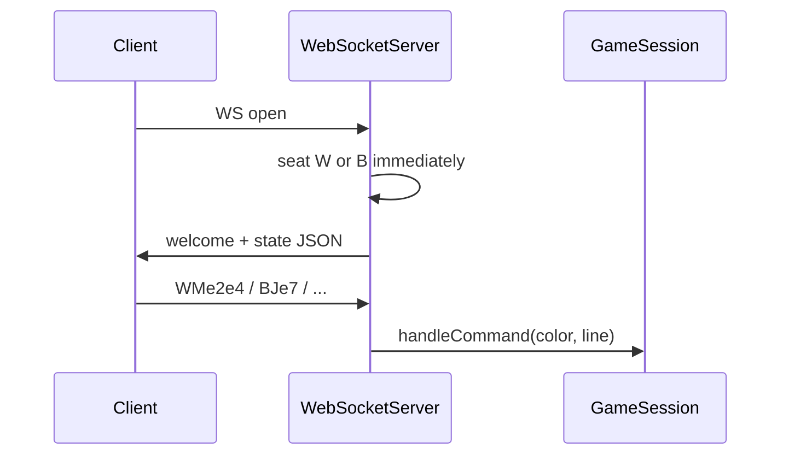
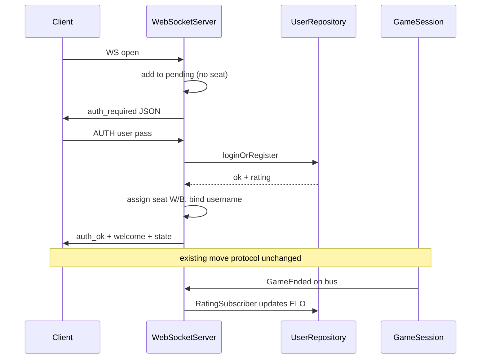

# Home Auth + ELO Rating (Server)

## Step 1 — Analysis (connection lifecycle)

Today’s flow in [`WebSocketServer.cpp`](src/server/WebSocketServer.cpp):



- **No auth exists** (docs still say “no rooms/auth yet”).
- Seats are FIFO in `onOpen` (`seats_[hdl] = 'W'|'B'`), then welcome/state are sent.
- Unseated messages already get `not_seated` — so a **connected-but-unauthenticated** state fits naturally by **deferring** the current seat block until after AUTH.

**Natural AUTH slot:** between WS open and seat assignment.



**SQLite:** not in [`third_party/`](third_party/) (only websocketpp, Asio, nlohmann/json). Vendor the official **sqlite3 amalgamation** (`sqlite3.c` / `sqlite3.h`) under `third_party/sqlite/` and compile it into the server target in [`build.bat`](build.bat) / [`CMakeLists.txt`](CMakeLists.txt).

---

## Step 2 — Proposed architecture

### 1. New `auth/` persistence module (SQL isolated here)

| File | Role |
|------|------|
| `include/auth/UserRepository.h` + `src/auth/UserRepository.cpp` | Open/create DB, schema, find/create/verify, get/set rating |
| `include/auth/PasswordHasher.h` + `src/auth/PasswordHasher.cpp` | Hash + verify helpers wrapping vendored bcrypt |
| `include/auth/Elo.h` + `src/auth/Elo.cpp` | Pure ELO math (`expectedScore`, `updateRating`) |
| `third_party/sqlite/sqlite3.{c,h}` | Official amalgamation (no wrapper lib) |
| `third_party/bcrypt/` | Portable Openwall-based bcrypt (C); salt embedded in hash string |

**Schema:**

```sql
CREATE TABLE IF NOT EXISTS users (
  username TEXT PRIMARY KEY NOT NULL,
  password_hash TEXT NOT NULL,
  rating INTEGER NOT NULL DEFAULT 1200
);
```

Default DB path: `data/users.db` (create `data/` on first open). Inject path from `WebSocketServer` / `server_main` so tests can use a temp file later.

**Password hashing:**

- **Chosen:** vendored **bcrypt** under `third_party/bcrypt/` (portable C, MinGW-friendly). bcrypt embeds its own salt in the stored hash string — no separate `salt` column.
- `PasswordHasher::hash(password) -> string` / `verify(password, hash) -> bool` wrap the C API; `UserRepository` only stores/compares the full bcrypt hash string.
- Cost factor: default bcrypt rounds (typically 10–12) — fine for a course server.

**API shape (illustrative):**

- `loginOrRegister(username, password) → AuthResult { ok, reason, rating }`
  - unknown user → insert with rating **1200**
  - known user → verify hash; fail with `bad_password`
- `getRating` / `setRating` for the ELO subscriber

Keep all `sqlite3_*` calls inside `UserRepository.cpp`.

### 2. Connection / wire protocol changes

**Client → server (new, plain text, same style as existing commands):**

```
AUTH <username> <password>
```

- Username: no spaces; password: rest of line after first space (allows spaces in password if we take “first token = user, remainder = password”).
- Only accepted while connection is in **pending** (not seated).
- Do **not** route AUTH through `GameSession` / move parser — handle in `WebSocketServer::onMessage` before the seated path.

**Server → client (JSON, additive):**

| Message | When |
|---------|------|
| `{"type":"auth_required"}` | On connect (pending) |
| `{"type":"auth_ok","username":"...","rating":1200,"color":"W"}` | After success (color = assigned seat) |
| `{"type":"error","reason":"bad_password"|"auth_required"|"invalid_auth"|"server_full"|"username_taken_wrong_pass"}` | Failures |

Then existing `welcome` + `state` (`reason: welcome`) as today.

**`WebSocketServer` changes (minimal):**

- `pending_` set of hdls (connected, not seated).
- `usernames_` map hdl → username (and/or color → username for rating).
- `onOpen`: if `pending + seated >= 2` → `server_full` + close; else add to `pending_`, send `auth_required`. **Do not seat yet.**
- `onMessage`:
  - if pending → parse `AUTH …` only; on success remove from pending, assign seat (same W-then-B rule), notify `RatingSubscriber` of W/B usernames, send auth_ok + welcome + state.
  - if seated → **unchanged** `session_.handleCommand` path (move/jump/wait/state).
- `onClose`: erase from pending and seats; clear username binding.
- Own `UserRepository` + subscribe `RatingSubscriber` next to MoveLog/Sound.

**Protocol layer:** optional tiny helper in [`StateSerializer`](include/protocol/StateSerializer.h) for `auth_required` / `auth_ok` JSON — or inline in server. Prefer serializer helpers to keep JSON in one place. **Do not change** `parseWireCommand` move/jump shapes.

### 3. Rating / ELO via Bus

**New** `bus/RatingSubscriber` (same Observer pattern as [`MoveLogSubscriber`](include/bus/MoveLogSubscriber.h)):

- Constructed with `UserRepository&`.
- `setPlayers(whiteUsername, blackUsername)` called by server when both seats filled (or update per seat as each authenticates).
- `onEvent`: on `GameEnded`, compute new ratings and `setRating` for both users.

**Standard ELO:**

\[
E_A = \frac{1}{1 + 10^{(R_B - R_A)/400}}, \quad
R'_A = R_A + K(S_A - E_A)
\]

- \(S\): 1 win / 0 loss / 0.5 draw  
- **K = 32** (common club/amateur default; good for a course ladder)

Round to nearest int when storing.

**Winner on `GameEnded` (small gap to fix):**

Today [`GameSession::publishArrivals`](src/server/GameSession.cpp) publishes:

```cpp
ended.type = GameEventType::GameEnded;
ended.reason = "king_captured";
// color NOT set — no winner field
```

`GameEnded` **does fire** (king capture → `gameOver`). It is **not** a stub for “event missing,” but it **lacks an explicit winner**. Minimal allowed touch: set `ended.color` to the **winner** (`'W'`/`'B'`) when publishing `GameEnded` in `GameSession` only (infer from the capture that ended the game — captured piece kind `K`). `RatingSubscriber` then uses `event.color` as winner. No GameEngine/model/rules changes.

### 4. What stays stubbed / out of scope

| Item | Status |
|------|--------|
| `GameEnded` on king capture | **Works** — already published from `GameSession` |
| Winner color on `GameEnded` | **Needs 1-line enrichment** (above) |
| Resign / draw / timeout → `GameEnded` | **Stub** — no resign/draw commands; ELO only runs on king-capture end |
| Rooms / spectators / multi-game | **Unchanged stub** (existing TODOs) |
| GUI home screen | **Out of scope** — AUTH is WS text only |
| Password reset / uniqueness UX beyond hash verify | **Out of scope** |
| Re-auth mid-game / reconnect resume | **Out of scope** |

### 5. Build & docs (when implementing)

- Compile `third_party/sqlite/sqlite3.c` and `third_party/bcrypt/src/*.c` into the server target; add `src/auth/*.cpp`, `src/bus/RatingSubscriber.cpp`.
- Update [`agents.mdc`](.cursor/rules/agents.mdc) / [`AGENTS.md`](AGENTS.md) / [`architecture.mdc`](.cursor/rules/architecture.mdc): `auth/` layer, AUTH wire command, rating via Bus.
- Manual test: Python/shell WS client — connect → expect `auth_required` → `AUTH alice secret` → welcome → play until king capture → check DB ratings moved.

### 6. Layer placement (dependency rule)

```
server_main → WebSocketServer → auth(UserRepository) + bus(RatingSubscriber) + GameSession → engine…
```

`auth/` must not include `server/` or `engine/`. `RatingSubscriber` depends on `bus` + `auth` only.
