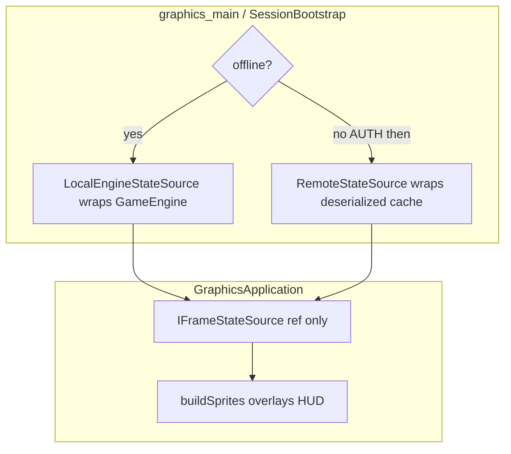
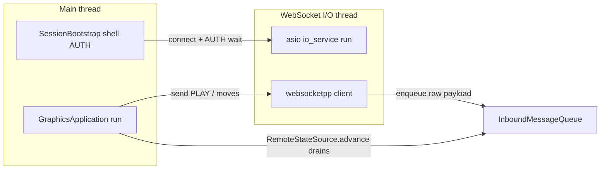
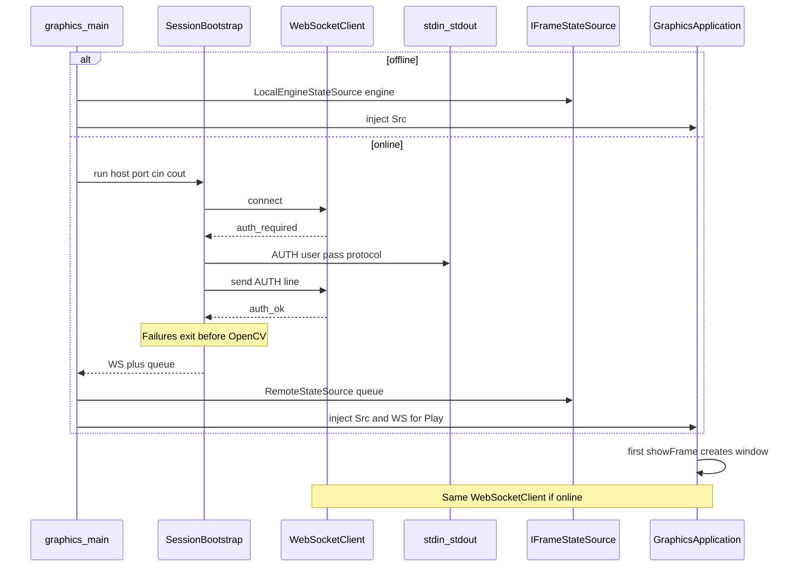

# WebSocket Client Architecture (Step 2 — design only)

## Locked defaults

- **State access:** `IFrameStateSource` injected once at construction. `GraphicsApplication` never branches on online/offline and never calls `engine_.snapshot()` / `activeMotions()` / `activeRests()` directly.
- **Mode choice:** once in `graphics_main` / `SessionBootstrap` — build either `LocalEngineStateSource` or `RemoteStateSource`, then construct `GraphicsApplication`.
- **Bootstrap:** `client::SessionBootstrap` owns blocking shell AUTH before any OpenCV window.
- **Endpoint:** `ws://127.0.0.1:9002`. Offline via `--offline` (composition root selects local source).
- **Zero changes** inside `model/`, `rules/`, `realtime/`, `engine/` — wrap only.



---

## 1. `WebSocketClient` — responsibility, threading, public API

**Layer:** new `client/` (outer, beside `server/`). Depends on websocketpp + Asio. Must **not** depend on `view/`, OpenCV, or `GraphicsApplication`.

**Responsibility**

- Own one persistent WebSocket for the process after connect (AUTH and GUI share it).
- Run `asio` / websocketpp I/O on a **dedicated background thread**.
- Thread-safe `send(text)` for outbound plain-text (`AUTH …`, `PLAY`, `WMe2e4`, …).
- Push every inbound text frame into a thread-safe inbound queue (raw strings).
- Blocking wait API **only** during shell AUTH (before OpenCV); GUI phase uses non-blocking drain only.

**Threading**



- I/O thread: `io_service::run()`, handlers, enqueue, perform sends posted onto the I/O strand.
- Main thread after window open: never blocks on network; only non-blocking queue drain (inside `RemoteStateSource::advance`) and `send` (posts to I/O thread).
- Shutdown: stop `io_service`, join I/O thread from `close()` / destructor.

**Public interface (conceptual)**

| Method | Role |
|--------|------|
| `connect(host, port)` | Start I/O thread, open WS; may block until open/fail (bootstrap). |
| `send(std::string line)` | Thread-safe outbound text (non-blocking for caller). |
| `waitForMessage(predicate, timeout)` | **Bootstrap only** — block until matching JSON (`auth_required` / `auth_ok` / `error`). |
| `inboundQueue()` | Shared queue reference for `RemoteStateSource` to drain each frame. |
| `isConnected()` / `close()` | Status and teardown. |

Delivery model: **queue only** — no callbacks into OpenCV from the I/O thread.

---

## 2. Thread-safe handoff and updating `RemoteStateSource`

**Queue:** `InboundMessageQueue` — `std::queue<std::string>` + `std::mutex` (+ `condition_variable` for bootstrap `waitForMessage` only).

| Producer | Consumer |
|----------|----------|
| websocketpp `on_message` (I/O thread): lock → push → unlock (+ notify if AUTH waiting) | **`RemoteStateSource::advance(dtMs)`** on the main thread each frame (called via `IFrameStateSource`) |

**Locks**

- Mutex A: inbound queue.
- Outbound `send`: `asio::post` to I/O strand (or a second mutex) so the render thread never touches the websocketpp connection object.
- No OpenCV / `Img` / `Renderer` shared with the I/O thread.

**How `RemoteStateSource` stays fresh**

1. `GraphicsApplication::run()` always calls `frameSource_.advance(dtMs)` at the top of the loop (same for local and remote).
2. `LocalEngineStateSource::advance` → `GameEngine::wait(dtMs)` (and may expose arrivals to a bus hook owned by the local composition, not by branching in the app).
3. `RemoteStateSource::advance` → non-blocking drain of the shared inbound queue → for each payload, `StateDeserializer` → on `type == "state"`, replace cached `GameSnapshot` / motions / rests / gameOver; on `searching` / `welcome` / `error`, update session metadata used by Play UI (not by sprite math).
4. Subsequent `getSnapshot()` / `activeMotions()` / `activeRests()` / `isGameOver()` read only that cache.

**Important:** the queue is **not** drained by `GraphicsApplication` with online checks. Drain lives **inside** `RemoteStateSource::advance`. Offline never creates a queue consumer.

---

## 3. `IFrameStateSource` + `StateDeserializer`

### Where the interface lives

**`include/graphics/IFrameStateSource.h`** (and matching `.cpp` only if needed — prefer header + impls in `.cpp` files per project rules).

**Why `graphics/`**

- Sole consumer today is the graphics frame loop.
- Return types are existing DTOs (`GameSnapshot`, `MotionView`, `RestView`) already used by graphics.
- Does **not** belong in `engine/` (would imply engine changes / wrong dependency direction).
- Does **not** belong in `view/` (view composites pixels; it should stay free of game-state APIs).

**Implementations**

| Class | Location | Wraps |
|-------|----------|--------|
| `LocalEngineStateSource` | `graphics/` (or `client/` — prefer **`graphics/`** next to the interface) | Existing `GameEngine&` |
| `RemoteStateSource` | `client/` | Latest deserialized cache + shared `InboundMessageQueue` |

### Interface (conceptual methods)

- `advance(int dtMs)` — local: `engine.wait`; remote: drain queue + update cache (dt unused or reserved).
- `getSnapshot() const` → `GameSnapshot`
- `activeMotions() const` → `vector<MotionView>`
- `activeRests() const` → `vector<RestView>`
- `isGameOver() const` → `bool`

Optional later (not required for first Play render): `lastArrivals()` only on local path can stay outside the interface if bus publishing for offline remains in a local-only collaborator injected at composition time.

### `StateDeserializer` (protocol layer)

- [`include/protocol/StateDeserializer.h`](include/protocol/StateDeserializer.h) + `src/protocol/StateDeserializer.cpp`
- Mirrors [`StateSerializer`](include/protocol/StateSerializer.h); uses nlohmann/json
- **No** `GameEngine` dependency on the deserialize path

**DTO: `protocol::RemoteStateMessage` (or similar)**

- From `state`: `status`, `reason`, `gameOver`, `board` → `GameSnapshot::cells`, `motions` → `vector<MotionView>` (algebraic squares via existing [`Algebraic`](include/protocol/Algebraic.h)), `rests` → `vector<RestView>`, `events` → `vector<GameEvent>` for history/sound
- Envelope helpers for `auth_required`, `auth_ok`, `error`, `searching`, `welcome` (bootstrap / Play session metadata)

**Both sources satisfy the same interface cleanly**

- Local: forward to `GameEngine::snapshot` / `activeMotions` / `activeRests` / `isGameOver`.
- Remote: return cached copies filled by deserializer; empty/default board until first `state` (pre-match preview policy — see open questions).

---

## 4. `GraphicsApplication` refactor (render path only from `IFrameStateSource`)

**Today (tight coupling):** owns `GameEngine engine_`; `run` / `buildSprites` / overlays call `engine_.snapshot()`, `engine_.activeMotions()`, `engine_.activeRests()`, `engine_.wait(dt)`.

**Target**

- Hold `IFrameStateSource& frameSource_` (or `unique_ptr` owned by composition root, reference in app).
- **Remove** direct render use of `engine_`.
- Minimal refactor:
  1. Replace `engine_.wait(dt)` with `frameSource_.advance(dt)`.
  2. Replace every `engine_.snapshot()` / `activeMotions()` / `activeRests()` in `buildSprites`, rest/legal overlays, banners with the interface getters.
  3. `isGameOver` / GAME OVER banner from `frameSource_.isGameOver()` (or snapshot flag).
  4. Keep `Controller` / board input as a **separately injected** concern (see §5); do not reintroduce `engine_` solely for rendering.

**Confirm:** no edits to `model/`, `rules/`, `realtime/`, or `engine/` sources — only `#include` of existing DTO headers from the new graphics/client wrappers.

**Legal-move overlays:** today call `engine_.legalMovesFrom`. That is **not** on `IFrameStateSource`. Options left as an open question (disable via injected input/helper, or a separate optional `ILegalMoveQuery` later). First increment can hide legal dots when no query is injected — still no online branch inside sprite code if the helper is always present (local query vs null object).

---

## 5. Shell-then-GUI flow and where Local vs Remote is chosen



**Shell AUTH location**

- New `client/SessionBootstrap` — blocking connect + AUTH via stdin/stdout (same wire as Python scripts: `AUTH user pass`).
- [`graphics_main.cpp`](src/graphics_main.cpp) stays thin composition root:
  1. Parse args (`--offline` vs host/port).
  2. **Choose and construct** `LocalEngineStateSource` **or** run bootstrap then `RemoteStateSource`.
  3. Construct `GraphicsApplication(layout, background, frameSource, …)` — **no mode flag**.
  4. `app.run()`.

**Window rule:** no `showFrame` / `namedWindow` until after `auth_ok` when online. Asset load may precede AUTH; window creation stays lazy inside `Img::display` on first frame.

**Play / network collaborators (also injected once, not branched in render)**

- Online: inject `WebSocketClient&` (or tiny `IMatchmaker` with `sendPlay()`) for the Play button.
- Offline: inject a no-op matchmaker so `GraphicsApplication` always calls `matchmaker_.requestPlay()` on button click without `if (online)`.

---

## 6. Play button

**Draw / hit-test (existing OpenCV pattern)**

- No toolkit. Fixed axis-aligned rect (e.g. bottom of left history panel).
- Draw via `Img::draw_filled_rect` / `put_text` (small `view::UiHitRect` or extend `Renderer` with optional widget list).
- On `Img::pollMouseClick`: if point in Play rect → UI action; else `BoardMapper::pixelToCell` as today.
- Later Room dialog reuses the same rect hit-test pattern. **Never** AUTH fields in the window.

**On click**

- Call injected matchmaker → `webSocketClient.send("PLAY")`.
- Session/UI labels (`searching`, errors) update when `RemoteStateSource::advance` sees `searching` / `error` / `welcome` (matchmaker or shared session object updated there). Offline no-op matchmaker → button can be hidden by `matchmaker_.isPlayVisible()` always false, still no online flag in the app.

---

## 7. Build changes

Graphics target today: OpenCV + engine/input/bus + `protocol/Algebraic.cpp`.

**Add**

- Sources: `WebSocketClient.cpp`, `SessionBootstrap.cpp`, `StateDeserializer.cpp`, `LocalEngineStateSource.cpp`, `RemoteStateSource.cpp`, any `UiHitRect` / matchmaker helpers.
- Includes: `third_party/websocketpp`, `third_party/asio/asio/include`, `third_party/json/single_include`.
- Defines: `ASIO_STANDALONE`, `_WEBSOCKETPP_CPP11_STL_`, `_WEBSOCKETPP_CPP11_THREAD_`, `_WIN32_WINNT=0x0601`.
- Link: mirror server socket libs (`ws2_32` etc. as needed) + existing OpenCV / `user32` / `gdi32` / `winmm`.
- Update [`build.bat`](build.bat) and [`CMakeLists.txt`](CMakeLists.txt); document in `agents.mdc` / `AGENTS.md` / architecture rules.

Do **not** link `auth/` SQLite/bcrypt into the graphics client.

---

## 8. Engine / model / rules / realtime touch list

| Area | Touch? |
|------|--------|
| `model/`, `rules/`, `realtime/`, `engine/` | **No source modifications.** Wrappers `#include` DTO / `GameEngine` headers only. |
| `graphics/IFrameStateSource` + `LocalEngineStateSource` | New — local wraps `GameEngine` without changing it. |
| `client/RemoteStateSource`, `WebSocketClient`, `SessionBootstrap` | New. |
| `protocol/StateDeserializer` | New; `StateSerializer` unchanged. |
| `GraphicsApplication`, `graphics_main`, light `Renderer`/`view` UI helpers | Yes — inject `IFrameStateSource`, remove direct engine snapshot calls. |
| `input/Controller` | Unchanged API preferred; online board input can be a separate injected collaborator later. |
| `server/` | No change required. |

---

## Suggested new files (no code yet)

```
include/graphics/IFrameStateSource.h
include/graphics/LocalEngineStateSource.h
include/client/WebSocketClient.h
include/client/InboundMessageQueue.h
include/client/RemoteStateSource.h
include/client/SessionBootstrap.h
include/client/IMatchmaker.h          # sendPlay / visibility; NoOp + WsMatchmaker
include/protocol/StateDeserializer.h
src/graphics/LocalEngineStateSource.cpp
src/client/*.cpp
src/protocol/StateDeserializer.cpp
```

Optional: `include/view/UiHitRect.h` for Play (and later Room).

---

## Open questions / tradeoffs before Step 3

1. **CLI default:** `--offline` (default online) vs default offline + `--host` (safer for current local-only users).
2. **Pre-match remote cache:** before first `state`, should `RemoteStateSource` expose the CSV layout as a static `GameSnapshot`, or an empty board / lobby-only frame?
3. **Legal-move overlays:** inject `ILegalMoveQuery` (local uses `GameEngine::legalMovesFrom`; remote null-object disables dots), or omit overlays online until a later step?
4. **AUTH stdin:** exact Python-script line `AUTH user pass` only, interactive prompts, or both?
5. **Password echo:** visible stdin (script-friendly) vs hidden input.
6. **Disconnect mid-game:** GAME OVER-style banner vs close window vs return to Play.
7. **Step 3 scope:** AUTH + `IFrameStateSource` refactor + Play + remote render only, or also wire move/jump `send` in the same increment?
8. **Offline arrivals / EventBus:** keep publishing from a local-only helper next to `LocalEngineStateSource`, or defer bus parity for online (events come from JSON `events` array) to a follow-up?
