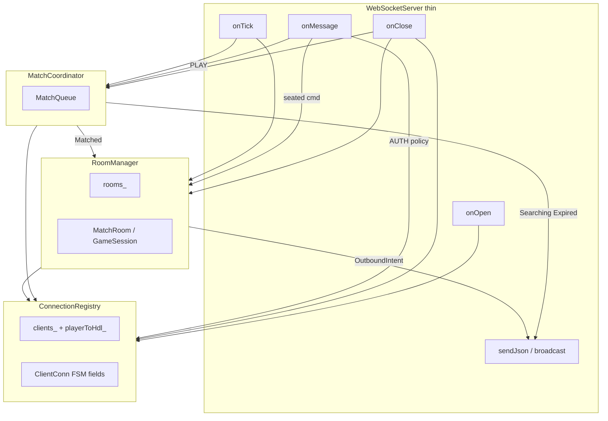

# WebSocketServer Four-Way Split

## Verdict on your split

The four pieces are the right seams for the dependencies found. Keep them.

**One refinement (not a counter-proposal):** MatchCoordinator *should* mutate queue-related client state through `ConnectionRegistry` (`Queued` on PLAY, back to `Authenticated` on expire). It still must **not** send JSON. Returning `Searching` / `Matched` / `Expired` covers wire side effects only; leaving FSM updates to `WebSocketServer` would re-bloat the dispatcher.

**RoomManager** needs more from `ConnectionRegistry` than raw hdls: usernames for `seatPlayers`, `setSeated(matchId, color)`, and reset-to-`Authenticated` on teardown. Accept `ConnectionHdl` on seats for this round (as you said).

**Outbound symmetry:** RoomManager decides *what* to send (welcome / game state / opponent_disconnected) and returns intents; only `WebSocketServer` calls `server_.send`. That mirrors MatchCoordinator and keeps both coordinators testable without websocketpp send.



---

## Clarifications (approved before Step 3)

1. **RoomManager ctor (exact):**
   ```cpp
   RoomManager(ConnectionRegistry& registry,
               UserService& users,
               std::ostream& moveLogOut,
               std::string soundsDir,
               std::ostream& soundOut);
   ```
   Matches today’s `MoveLogSubscriber(std::ostream&)` and `SoundSubscriber(std::string, std::ostream&)`. Thin WSS passes `std::cout`, `"assets/sounds"`, `std::cout`.

2. **`already_searching`:** Already handled today in `onMessage` when `Queued` + `PLAY` (before `handlePlay`). Putting the same check in `MatchCoordinator::play` is a **relocate**, not a new behavior.

3. **Dummy `ConnectionHdl` for tests:** keep a `shared_ptr` alive; assign to `connection_hdl` (weak-handle):
   ```cpp
   std::shared_ptr<void> alive = std::make_shared<int>(0);
   ConnectionHdl hdl = alive;
   ```

**Step 3 order (stop for review after each):** ConnectionRegistry → MatchCoordinator → RoomManager → slim WebSocketServer → then regression `test_auth.py` / `test_matchmaking.py` → then `MatchCoordinatorTest.cpp`.

---

## Ownership and lifetime

`WebSocketServer` constructs and owns everything; lifetime = server process.

| Owner | Owns | Injects |
|-------|------|---------|
| **WebSocketServer** | `WsServer`, tick timer, `UserRepository` / `UserService` / `AuthController`, `ConnectionRegistry`, `MatchCoordinator`, `RoomManager` | — |
| **MatchCoordinator** | `MatchQueue` | `ConnectionRegistry&` |
| **RoomManager** | `rooms_`, `nextMatchId_`, **`MoveLogSubscriber`**, **`SoundSubscriber`** | `ConnectionRegistry&`, `UserService&`, `ostream&` / `soundsDir` |

**Shared subscribers move into RoomManager** (only consumer is `MatchRoom` construction). Auth stack stays on `WebSocketServer` (AUTH path never needs RoomManager).

Construction order in `WebSocketServer` ctor:

1. auth stack (`usersRepo_` → `users_` → `auth_`)
2. `registry_`
3. `matchCoordinator_(registry_)`
4. `roomManager_(registry_, users_, std::cout, "assets/sounds", std::cout)`

Destructor: `running_ = false`; `roomManager_.clear()` (or destroy rooms); registry clears with connections via normal close path.

---

## 1. `ConnectionRegistry`

**Files:** [`include/server/ConnectionRegistry.h`](include/server/ConnectionRegistry.h), [`src/server/ConnectionRegistry.cpp`](src/server/ConnectionRegistry.cpp)

Move `ClientState`, `ClientConn` here (out of [`WebSocketServer.h`](include/server/WebSocketServer.h)).

`ConnectionHdl` remains the key type this round (same as today; tests can use dummy `connection_hdl` from `shared_ptr` without a listening socket).

```cpp
enum class ClientState { PendingAuth, Authenticated, Queued, Seated, Viewer };

struct ClientConn {
    ClientState state = ClientState::PendingAuth;
    std::string username;
    int rating = 0;
    MatchQueue::PlayerId playerId = -1;
    int matchId = -1;
    char color = '?';
};

class ConnectionRegistry {
public:
    // Lifecycle
    MatchQueue::PlayerId registerConnection(ConnectionHdl hdl); // alloc id, PendingAuth, map both ways
    void removeConnection(ConnectionHdl hdl);                 // erase clients_ + playerToHdl_

    // Lookup
    ClientConn* getClient(ConnectionHdl hdl);
    const ClientConn* getClient(ConnectionHdl hdl) const;
    std::optional<ConnectionHdl> hdlForPlayer(MatchQueue::PlayerId id) const;
    bool usernameAlreadyConnected(const std::string& username) const;
    int seatedCount() const;

    // FSM mutations (callers enforce which transitions are legal)
    void setAuthenticated(ConnectionHdl hdl, const std::string& username, int rating);
    void setViewer(ConnectionHdl hdl, const std::string& username, int rating);
    void setQueued(ConnectionHdl hdl);
    void setAuthenticatedFromQueue(ConnectionHdl hdl); // expire / cancel queue → Authenticated, clear match fields
    void setSeated(ConnectionHdl hdl, int matchId, char color);
    void clearSeat(ConnectionHdl hdl); // → Authenticated, matchId=-1, color='?'
};
```

No send. No auth credential checks. No queue.

**AUTH policy stays in `WebSocketServer::handleAuth`** (calls `auth_`, then registry): duplicate login via `usernameAlreadyConnected`; viewer vs player via `seatedCount() >= 2` — preserve behavior, do not bury that heuristic inside the registry (see Flags below).

---

## 2. `MatchCoordinator`

**Files:** [`include/server/MatchCoordinator.h`](include/server/MatchCoordinator.h), [`src/server/MatchCoordinator.cpp`](src/server/MatchCoordinator.cpp)

Owns `MatchQueue`. Mutates only queue-related registry state. Returns wire intents; never calls send.

```cpp
struct MatchPlayResult {
    enum class Kind { Rejected, Searching, Matched } kind;
    std::string rejectReason;           // viewer_cannot_play | not_authenticated | already_searching
    ConnectionHdl white;                // Kind::Matched
    ConnectionHdl black;
};

struct MatchExpireEvent {
    ConnectionHdl hdl;                  // already set back to Authenticated in registry
};

class MatchCoordinator {
public:
    explicit MatchCoordinator(ConnectionRegistry& registry);

    void removeFromQueue(MatchQueue::PlayerId id);  // onClose

    // Preconditions checked here using registry state; sets Queued + enqueue + tryMatch
    MatchPlayResult play(ConnectionHdl hdl);

    // matchQueue_.expire(now); for each: resolve hdl, setAuthenticatedFromQueue, collect events
    std::vector<MatchExpireEvent> expire(MatchQueue::TimePoint now);

private:
    ConnectionRegistry& registry_;
    MatchQueue queue_;
};
```

`play` internal flow (same as today’s `handlePlay` + `tryMatch`):

1. Reject if missing / Viewer / not Authenticated / already Queued (`already_searching`)
2. `setQueued` + `queue_.enqueue(playerId, rating, now)`
3. `queue_.tryMatch` → miss: `Searching`; hit: resolve both hdls via `hdlForPlayer` → `Matched` (does **not** set Seated)

**Testability:** unit tests with a real `ConnectionRegistry` + dummy hdls (no `WsServer`). Assert queue size, returned `Kind`, and registry states. No mock interface required unless you prefer one later.

---

## 3. `RoomManager`

**Files:** [`include/server/RoomManager.h`](include/server/RoomManager.h), [`src/server/RoomManager.cpp`](src/server/RoomManager.cpp)

Owns `rooms_`, `nextMatchId_`, `MoveLogSubscriber`, `SoundSubscriber`.

```cpp
struct OutboundMessage {
    ConnectionHdl hdl;
    std::string payload;   // already serialized JSON
};

struct RoomCommandResult {
    std::vector<OutboundMessage> messages; // typically two seats, same payload
    std::string errorReason;               // if empty + messages empty → no-op; if set → single error to caller hdl
};

class RoomManager {
public:
    RoomManager(ConnectionRegistry& registry, UserService& users,
                /* moveLog/sound ctor args matching today */);

    // create MatchRoom, seatPlayers, setSeated both sides, drainEvents, build welcome+state payloads
    std::vector<OutboundMessage> createMatch(ConnectionHdl white, ConnectionHdl black);

    // notify remaining opponent, clearSeat, erase room (skip exceptHdl)
    std::vector<OutboundMessage> tearDownMatch(int matchId, ConnectionHdl exceptHdl);

    // seated path: handleCommand + serializeGameStateJson for both seats
    RoomCommandResult handleSeatedCommand(ConnectionHdl hdl, const std::string& line);

    // tick all rooms; return broadcasts only when events/motions/rests warrant (same predicate as today)
    std::vector<OutboundMessage> tickAll(int ms);

    void clear(); // dtor / shutdown
};
```

**Needs from registry beyond hdls:** `getClient` (username, color, matchId, state checks), `setSeated`, `clearSeat`.

Does **not** own AUTH/PLAY/queue. Does **not** call `server_.send`.

`broadcastToRoom` logic becomes: build one payload, push `OutboundMessage` for white and black if present (viewer TODO unchanged).

---

## 4. Thin `WebSocketServer`

Keeps: asio/websocketpp bootstrap, handlers, `sendJson`, tick timer, AUTH orchestration, dispatch.

| Handler | Delegates |
|---------|-----------|
| `onOpen` | `registry_.registerConnection` + `sendJson(auth_required)` |
| `onClose` | `matchCoordinator_.removeFromQueue`; if Seated → send `roomManager_.tearDownMatch`; `registry_.removeConnection` |
| `onMessage` PendingAuth | `handleAuth` → `auth_` + registry setAuthenticated/setViewer + send |
| `onMessage` Viewer | send errors (unchanged) |
| `onMessage` PLAY | `matchCoordinator_.play` → send searching / errors; on Matched → `roomManager_.createMatch` → send welcomes |
| `onMessage` Seated | `roomManager_.handleSeatedCommand` → send each `OutboundMessage` (or error) |
| `onTick` | `matchCoordinator_.expire` → send `match_not_found`; `roomManager_.tickAll` → send |

`sendJson` stays private on `WebSocketServer`. Helper `sendAll(const vector<OutboundMessage>&)` optional.

---

## Awkward boundary flags

1. **Viewer promotion (`seatedCount() >= 2`)** — Lives in AUTH (`handleAuth`), not MatchCoordinator/RoomManager. Awkward with multi-match (any two seated players make the next AUTH a Viewer even if they could PLAY into a new match). **Preserve as-is** in thin `WebSocketServer`; do not “fix” into RoomManager this round. Document as known legacy.

2. **Duplicate-login check** — Fits `ConnectionRegistry::usernameAlreadyConnected`; policy decision (“reject with `already_logged_in`”) stays in `handleAuth`. Clean.

3. **Matched → createMatch handoff** — MatchCoordinator returns hdls; WebSocketServer must call `RoomManager::createMatch` next. Brief orchestration in the thin server is intentional, not a smell.

4. **Who sets `Seated`?** — **RoomManager only** (inside `createMatch`). MatchCoordinator stops at `Queued` / `Matched` result. Avoid double mutation.

5. **`ConnectionHdl` in “pure” tests** — Headers still pull websocketpp `connection_hdl`. Acceptable: no listening socket, dummy hdls. Full `PlayerId`-only abstraction is out of scope this round.

6. **`MatchRoom` still stores seat hdls** — RoomManager tearDown/broadcast stay transport-typed. Accepted limitation.

7. **Shared `MoveLogSubscriber` / `SoundSubscriber`** — Moving ownership to RoomManager changes *who* constructs them, not subscribe semantics. `WebSocketServer` no longer includes those headers except indirectly.

8. **Expire + tick coupling** — Tick remains the clock source in `WebSocketServer`; both coordinators stay timer-agnostic (good).

---

## Files / docs / tests (Step 3 scope preview — not implementing now)

- Add: `ConnectionRegistry`, `MatchCoordinator`, `RoomManager` `.h`/`.cpp`
- Slim: [`WebSocketServer.h`](include/server/WebSocketServer.h) / [`.cpp`](src/server/WebSocketServer.cpp)
- Register new `.cpp` in [`build.bat`](build.bat) + [`CMakeLists.txt`](CMakeLists.txt)
- Update [`AGENTS.md`](AGENTS.md), [`.cursor/rules/agents.mdc`](.cursor/rules/agents.mdc), [`.cursor/rules/architecture.mdc`](.cursor/rules/architecture.mdc)
- New unit tests: `MatchCoordinatorTest.cpp` (registry + dummy hdls); optional thin `ConnectionRegistryTest` for duplicate username / seatedCount
- No behavior change intended for `test_auth.py` / `test_matchmaking.py` wire contracts

---

## Approval checkpoint

Confirm this interface set (especially: MatchCoordinator mutates Queued/Authenticated via registry; RoomManager returns `OutboundMessage`s; subscribers owned by RoomManager; viewer heuristic stays in `handleAuth`). Step 3 implements only after you approve.